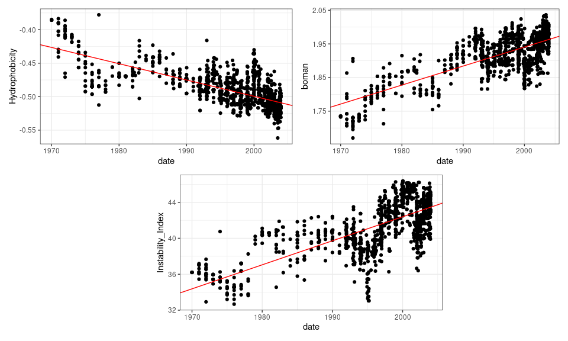
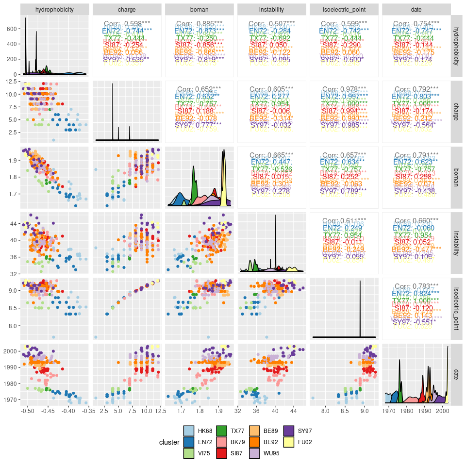

-   [1 Predicting Antigenic Coordinates from Sequence
    Data](#predicting-antigenic-coordinates-from-sequence-data)
    -   [1.1 Evolution of Physiochemical Properties Over
        Time](#evolution-of-physiochemical-properties-over-time)
    -   [1.2 Data](#data)
        -   [1.2.1 Trends in antigenic map coordinate
            planes](#trends-in-antigenic-map-coordinate-planes)

1 Predicting Antigenic Coordinates from Sequence Data
=====================================================

Many influenza samples are collected each year and the hemagglutinin
(HA) gene segment, if not all gene segments, are sequenced from many
collected samples. Sequence data is quite useful when identifying
subtypes or genotypes of a sample or when performing phylodynamic
analyses. Hemagglutinin inhibition (HI) assays can also be performed on
isolates to provide information on the viral antigenic characterization
and the efficacy of a vaccine against the sample. HI assay measurements
may also be used to map isolates onto an antigenic map, providing a
quantification and visualization of antigenic evolution. HI assay
measurements, however, require a time-intensive protocol and, therefore,
fewer isolates are assayed than are sequenced. This discrepancy between
the amount of genetic data and corresponding phenotypic
characterizations presents challenges when measuring phenotypic
movements of an evolving strain. Aim 2 of the proposal submitted to the
CDC describes a proposed methodology for addressing this issue.

To develop a predictive model (as described in aim 3 in the proposal),
data must be extracted from isolate sequence data and related back to
the HI assay results (*e.g.* antigenic coordinates). An understanding of
the HI assay is useful here. The HI assay uses a serial dilution of
serum/antiserum to identify the concentration needed to block
hemagglutination of the viral particles and red blood cells. The HI
titer value is the inverse of the last dilution of antibodies that
neutralized hemagglutination. As dilutions increase, any binding
affinity between antibodies and viral particles is disrupted. While
maintaining the ability to bind to host cells, any reduction in the
binding affinity of antibodies due to physiochemical changes (*e.g.*
hydrophobicity, polarity, etc.) in the HA gene segment would be
evolutionarily advantageous.

1.1 Evolution of Physiochemical Properties Over Time
----------------------------------------------------

In general, HA1, one of the two subunits (HA1 and HA2) comprising the HA
gene segment, shows signatures of strong positive selection to evolve
novel antigenic variants (Bush, Fitch, et al.
[1999](#ref-bushPositiveSelectionH31999),
@bushPredictingEvolutionHuman1999). As strong selection from immune
pressure evolves novel variants of influenza strains, directional
responses are seen values of physiochemical properties through time. For
example, Arinaminpathy and Grenfell
([2010](#ref-arinaminpathyDynamicsGlycoproteinCharge2010)) showed that
directional selection pressure on HA1 subunit from influenza A/H3N2
viruses lead to an increase in polarity from 1968 to 2003. We
demonstrate similar directional responses in other physiochemical
measurements from sequences during that same time period (fig .
<a href="#fig:physiochemicalTrends">1.1</a>). Some further research has
shown a similar phenomena occurring in influenza B viruses (Saad-Roy et
al. [2020](#ref-saad-royImplicationsLocalizedCharge2020)).

Figure 1.1: Directional trends in physiochemical properties measured
from influenza A/H3N2 samples collected between 1968 and 2003.

It is my hypothesis that we can use physiochemical measurements, along
with other data, as features in a model to predict the antigenic
coordinates of future isolates.

1.2 Data
--------

To begin tackling this issue, I have limited myself to the data provided
by Smith et al. ([2004](#ref-smithMappingAntigenicGenetic2004a)). This
data source provides amino acid sequences of the HA1 subunit, HI assay
measurements and published antigenic coordinates (from the published
2-dimensional antigenic map). Sequences are provided with the year which
samples were collected but there is no further resolution (*e.g.* day,
month). The collection year ranges from 1968 to 2003. The sampling
distribution is not even with respect to this time range. From these
sequences, I have constructed a phylogenetic tree and measured
physiochemical properties of each sequence.

### 1.2.1 Trends in antigenic map coordinate planes

Trends in each of the coordinate planes (when samples are sorted by
collection year) within antigenic maps depends on the number of
dimensions used in the map. The original map presented by Smith
([2004](#ref-smithMappingAntigenicGenetic2004a)) is a 2-dimensional map
where one of the antigenic coordinate planes (equivalent to the
x-coordinate plane) shows a wave pattern and the other (equivalent to
the y-coordinate plane) shows a linear pattern
(fig. <a href="#fig:twoDimensionalTrend">1.2</a>). If, however, HI titer
results are only reduced to a 3-dimensional map, the pattern in
coordinate values in each plane are not as complex (fig .
<a href="#fig:threeDimensionalTrend">1.3</a>).

Figure 1.2: Trends in coordinate values of two-dimensional antigenic
map. Samples are sorted by collection date.

Figure 1.3: Trends in coordinate values of three-dimensional antigenic
map. Samples are sorted by collection date.

#### 1.2.1.1 Data Overview

Here is a segment of the data being used (each row corresponds to a
single sequence):

    ##        seq_id antigenic_x antigenic_y cluster   distRoot branch_length hydrophobicity   charge    boman instability
    ## 1 BI/15793/68    4.472241    13.39237    HK68 0.03149767  1.000001e-06     -0.3570122 3.996253 1.669634    35.52774
    ## 2 BI/16190/68    4.512187    13.17287    HK68 0.03839661  1.000001e-06     -0.3731707 2.996700 1.701341    36.74421
    ## 3 BI/16398/68    4.712129    12.26485    HK68 0.03839661  1.000001e-06     -0.3731707 2.996700 1.701341    36.74421
    ## 4     HK/1/68    6.633645    12.06504    HK68 0.01509739  1.509739e-02     -0.3935976 7.058078 1.758780    37.84329
    ## 5   BI/808/69    4.255131    12.68464    HK68 0.03143093  1.047409e-02     -0.3987805 3.996697 1.772348    35.75610
    ## 6   BI/908/69    5.239908    12.42664    HK68 0.03491484  1.000001e-06     -0.3731707 3.996253 1.695000    36.28598
    ##   isoelectric_point
    ## 1          8.530219
    ## 2          8.340089
    ## 3          8.340089
    ## 4          8.954948
    ## 5          8.530167
    ## 6          8.530219

The features in this data are as follows:

1.  `distRoot`: distance of sample from the root of the phylogeny
    (`adephylo::distRoot`, (Jombart, Balloux, and Dray
    [2010](#ref-jombartAdephyloNewTools2010))).
2.  `branch_length`: branch length on the phylogeny from a preceding
    node to the isolate (using `ape` (Paradis and Schliep
    [2019](#ref-paradisApeEnvironmentModern2019)))
3.  `hydrophobicity`: hydrophobicity index of amino acid sequence
    (`Peptides::hydrophobicity`, (Osorio, Rondón-Villarrea, and Torres
    [2015](#ref-osorioPeptidesPackageData2015))).
4.  `charge`: theoretical net charge of amino acid sequence
    (`Peptides::charge`, (Osorio, Rondón-Villarrea, and Torres
    [2015](#ref-osorioPeptidesPackageData2015))).
5.  `boman`: Boman (Potential Protein Interaction) index of amino acid
    sequence (`Peptides::boman`, (Osorio, Rondón-Villarrea, and Torres
    [2015](#ref-osorioPeptidesPackageData2015))).
6.  `instability`: instability index of amino acid sequence
    (`Peptides::instaIndex`, (Osorio, Rondón-Villarrea, and Torres
    [2015](#ref-osorioPeptidesPackageData2015))).
7.  `isoelectric_point`: theoretical isoelectric point of the amino acid
    sequence (`seqinr::AAstat`, (Charif and Lobry
    [2007](#ref-charifSeqinR02Contributed2007))).

Figure 1.4: Correlation matrix of physiochemical properties and their
values when measured from each sample included in the Smith et al. 2004
data. Color of each data point corresponds to the antigenic cluster
which the sample belongs.

Arinaminpathy, Nimalan, and Bryan Grenfell. 2010. “Dynamics of
Glycoprotein Charge in the Evolutionary History of Human Influenza.”
Edited by Jean-Pierre Vartanian. *PLoS ONE* 5 (12): e15674.
<https://doi.org/10.1371/journal.pone.0015674>.

Bush, R. M., C. A. Bender, K Subbarao, N. J. Cox, and W. M. Fitch. 1999.
“Predicting the Evolution of Human Influenza A.” *Science* 286 (5446):
1921–5. <https://doi.org/10.1126/science.286.5446.1921>.

Bush, R. M., W. M. Fitch, C. A. Bender, and N. J. Cox. 1999. “Positive
Selection on the H3 Hemagglutinin Gene of Human Influenza Virus A.”
*Molecular Biology and Evolution* 16 (11): 1457–65.
<https://doi.org/10.1093/oxfordjournals.molbev.a026057>.

Charif, Delphine, and Jean R. Lobry. 2007. “SeqinR 1.0-2: A Contributed
Package to the R Project for Statistical Computing Devoted to Biological
Sequences Retrieval and Analysis.” In *Structural Approaches to Sequence
Evolution*, edited by Elias Greenbaum, Ugo Bastolla, Markus Porto, H.
Eduardo Roman, and Michele Vendruscolo, 207–32. Berlin, Heidelberg:
Springer Berlin Heidelberg.
<https://doi.org/10.1007/978-3-540-35306-5_10>.

Jombart, Thibaut, François Balloux, and Stéphane Dray. 2010. “Adephylo:
New Tools for Investigating the Phylogenetic Signal in Biological
Traits.” *Bioinformatics* 26 (15): 1907–9.
<https://doi.org/10.1093/bioinformatics/btq292>.

Osorio, Daniel, Paola Rondón-Villarrea, and Rodrigo Torres. 2015.
“Peptides: A Package for Data Mining of Antimicrobial Peptides.” *R
Journal* 7 (1).

Paradis, Emmanuel, and Klaus Schliep. 2019. “Ape 5.0: An Environment for
Modern Phylogenetics and Evolutionary Analyses in R.” Edited by Russell
Schwartz. *Bioinformatics* 35 (3): 526–28.
<https://doi.org/10.1093/bioinformatics/bty633>.

Saad-Roy, Chadi M., Nimalan Arinaminpathy, Ned S. Wingreen, Simon A.
Levin, Joshua M. Akey, and Bryan T. Grenfell. 2020. “Implications of
Localized Charge for Human Influenza A H1N1 Hemagglutinin Evolution:
Insights from Deep Mutational Scans.” Edited by Rustom Antia. *PLOS
Computational Biology* 16 (6): e1007892.
<https://doi.org/10.1371/journal.pcbi.1007892>.

Smith, D. J. 2004. “Mapping the Antigenic and Genetic Evolution of
Influenza Virus.” *Science* 305 (5682): 371–76.
<https://doi.org/10.1126/science.1097211>.

